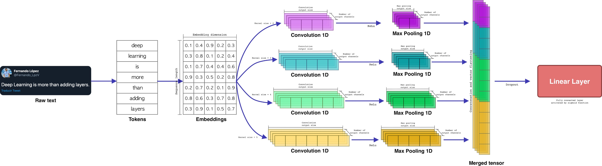
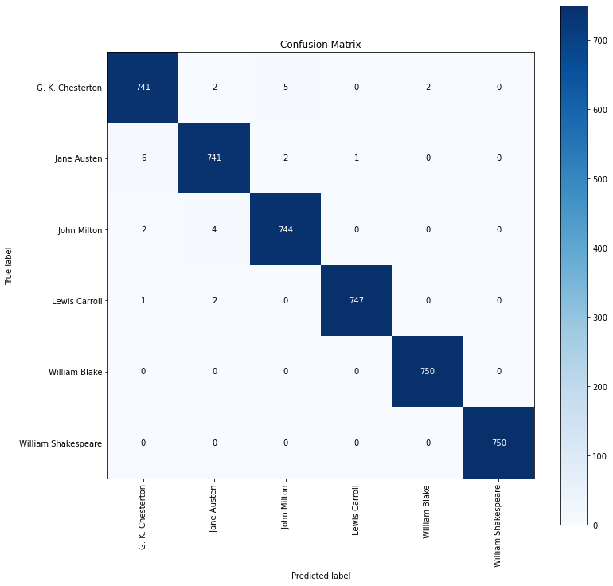
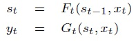
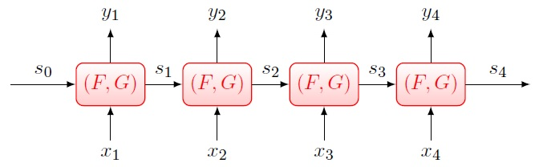
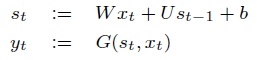
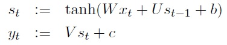
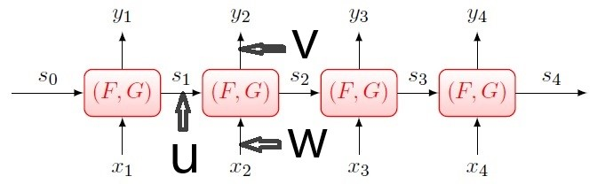

# Classification
## Authorship
&nbsp;&nbsp; The art and science of discriminating between writing styles of authors by identifying the characteristics of the persona of the authors and examining articles authored by them is called Authorship Analysis.<br/>
Here we are going to do authorship by examining the articles written by that author. <br/>

## Data Preperation
&nbsp;&nbsp; I chose 6 books at random from 'gutenberg' in **nltk** library. It contains 18 books of twelve authors. Then I created a data frame of two columns (Text, Authors(labels)) as a training dataset.  The data frame includes 18000 rows of 400 characters, 3000 rows for each author. Each row contains 400 characters. The starting character will be selected at random and the 399 subsequent characters will be added.

## Data Cleaning
&nbsp;&nbsp;I defined some functions to clean the text before applying it to the model. This part could be one of the most time-consuming and challenging jobs in data processing. Fortunately working with Latin scripts is not as hard as scrips like Persian. In our case, because the texts are stories and poems, I decided to use the following functions for data cleansing. <br/>
&nbsp;&nbsp;*clean_text(x)* function removes any character which is NOT a number or an alphabet. The regular expression *[^a-zA-z'\s]* does this job. When the first character in the set notation is a caret(^), it inverts the logic. This pattern matches a single character that is anything *other than* an uppercase or lowercase letter ,"'" or white space. I kept this character "'" because we use it when we write in short forms like "aren't". I am going to replace the short form with the extended form and I need this character for that purpose. I also replaced the single characters with white space because in our case those characters do not convey any information and will not help the model training. <br/>

&nbsp;&nbsp; The function *replace_contractions(text)*, replaces contractions for example, "aren't" with "are not". To do this, we need a dictionary whose keys would be the contraction forms and the values are the extended form of that contraction. Then we compile a regular expression (RE) using the dictionary keys. we separate each key with "or" (i.e with this character "|") in the compiled RE. We do this by *_get_contractions(contraction_dict)*.
Data cleaning usually involves many other activities but in our case, these two cleaning functions are enough.

## Feature Engineering
&nbsp;&nbsp;We can not train a model we raw text; we need to transfer it to numbers. To do this I used pre-trained "GloVe100". It was possible to use "tfidf".<br/>
First, we tokenize our text. Keras provides the Tokenizer class for preparing text documents for deep learning. The Tokenizer must be constructed and then fit on either raw text documents or integer encoded text documents.
Once fit, the Tokenizer provides 4 attributes that you can use to query what has been learned about your documents:

- **word_counts**: A dictionary of words and their counts.
- **word_docs**: A dictionary of words and how many documents each appeared in.
- **word_index**: A dictionary of words and their uniquely assigned integers.
- **document_count**: An integer count of the total number of documents that were used to fit the Tokenizer. <br/>

&nbsp;&nbsp;We just needed all the unique words in our train dataset and we could do it in another way instead of tokenizing, but using Keras tokenizer is the easiest way. We use the indexes of **word_index** dictionary which are the required words, to create our final embedding matrix. <br/>

### How to use GloVe (Global Vector)
&nbsp;&nbsp; In GloVe100, each word has been represented by a vector of 100 dimensions. There are other versions of GloVe. The [glove.6B.100d.txt](https://nlp.stanford.edu/projects/glove/) (download glove.6B.zip), contains 400,000 vectorized words. Each word is separated from its associated vector of numbers with space. It has already been trained which means if two words have similar semantics, their associated vectors will have similar numbers. It is also possible to train it ourselves based on our corpus. In this case, we just rely on local statistics (local context information of words) but GloVe leverages both global and local statistics of a corpus. <br/>

The function **load_glove(word_index)** takes our train dataset unique words, finds that words in the *glove.6B.100d.txt* which is already converted to a dictionary (embeddings_index). The keys in this dictionary are words and the values are arrays of 100 numbers. This function returns a matrix of numbers with 21481 x 100 dimensions.  (21481 is the number of unique words in our corpus and may change if you run the code.). we use this matrix to train our models. <br/>

# Text Classification with Deep Neural Network Models in Pytorch
&nbsp;&nbsp; I will compare two famous deep learning models namely, LSTM and CNN, in the text classification task. Even though I have mainly worked with Keras for DNN modeling, this time I decided to use Pytorch. Pytorch is a relatively new deep learning framework based on Torch. Developed by Facebook’s AI research group and open-sourced on GitHub in 2017, it’s used for **natural language processing** applications which is what we are going to do here. Pytorch has a reputation for simplicity, ease of use, flexibility, efficient memory usage, and dynamic computational graphs. It also feels native, making coding more manageable and **increasing processing speed**. In our case, each input is going to be a matrix of 200x100 which is too much and having more speed would be a great help. However, the readability of the codes in Pytorch is less than Keras. Keras, Tensorflow, and Pytorch have their own pros and cons, and based on the problem at hand, we should choose between them.
## Text classification with CNN  
&nbsp;&nbsp; As we know, CNNs are originally invented for computer vision.  With the same idea as in computer vision, the CNN model is used as a feature extractor that encodes semantic features of sentences before these features are fed to a classifier. One of the earliest applications of CNN in Natural Language Processing was introduced in the paper [Convolutional Neural Networks for Sentence Classification (Kim, 2014)](https://arxiv.org/abs/1408.5882). I have already explained CNN [here](https://github.com/HosseinDvz/Python/tree/main/Deep-Learning/CNN). For image classification, each kernel extracts a feature like a color or a line but in the context of text classification, kernels extract semantics from the text. See the following picture from https://towardsdatascience.com/:

<p align="center"><br/>
  
 &nbsp;&nbsp; First, each input sentence goes through the already provided embedding matrix and is converted into numbers. i.e The relevant vector for each word in the sentence will be found and extracted from the embedding matrix and put together to provide the input matrix. In our case, each row of the matrix has 100 columns and the number of rows depends on the number of words which are 200 here. Then they will go through different parallel (like GoogleNet) one-dimensional (unlike GoogleNet) convolutional layers with different kernel sizes. For this job, we do not need to stack convolutional layers and one layer would be enough.<br/>
 1-D convolutional layers usually use in Natural Language Processing (NLP). We specify the number of rows in Conv1D kernels which will be the number of consecutive words that we want to consider at the same time and the number of columns would be the number of columns in embedding matrix, in our case, 100 (each word represented with a vector of 100 numbers or dimensions)). That is why the output of the convolutional layers is just one row of numbers. It makes sense because each row in our input is one specific word and we do not want to cut it. The difference between Conv1D and Conv2D, other than the size of their kernels, is that Conv1d is only capturing one of the two correlations (either vertical or horizontal), thus yielding much more limited information. It would be enough in the case of text analysis because we just care about the vertical correlations which show the order of the words. On the other hand, Conv2D manage to capture this influence in both spatial directions, horizontal and vertical which is good for image classification.
 In our CNN, we have three different kernel sizes of 1x100,2x100,3x100. the number of each kernel is 30. These parameters can be changed and I suggest you change them and see the results. Here are the results after 8 epochs:<br/>
  ```
  Epoch 3/8 	 loss=22.4788 	 val_loss=15.1590  	 val_acc=0.9800  	 time=14.37s
  Epoch 8/8 	 loss=4.8529 	 val_loss=3.9497  	 val_acc=0.9940  	 time=13.79s
  ```
  and here is the confusion matrix:<br/>
  <p align="center"><br/>
    
 
 &nbsp;&nbsp; As we see, CNN achieved pretty good results in our text classification task.<br/>
  In clustering segment, when I try to analyse the input, we will see why model can not achieve %100 accuracy.
 
 ## Long-Short Term Memory (LSTM)
    
&nbsp;&nbsp; LSTM belongs to the family of Recurrent Neural Networks (RNN) which are famous for their applications in analysing the time series. Machine learning tasks involving time series includes:<br/>
  - Processing sequence data (e.g., sentiment analysis in NLP)
  - Generating sequence data (e.g., as natural language generation in NLP)
  - Learning the representation of sequence data (e.g., word embedding in NLP)
  - Combination of above (e.g., machine translation, document summarization, chatbot)<br/>
<br/>  
    
    
    
    
 Before delving in RNN, first we need to know what is a **Causal System** and **System State**.<br/>
    
#### Causal System
    
&nbsp;&nbsp; Recall a system is anything that takes an input signal x(t) and generates an output signal y(t), where, at each time t, both x(t) and y(t) can be vectors. A system is said to be **Causal** if at any time t >= 1, y(t) is independent of x(t+1), x(t+2), ... i.e, the output of the system only depends on the input at that time or the past, NOT the future (For online applications the system must be causal because future has not happened yet but for offline applications (like a recorded voice) the system can be non-causal). <br/>
&nbsp;&nbsp; A fundamental result regarding causal systems is that in any causal system, there exists a notion of **state**. The state of a causal system is a variable s(t) (with t = 0, 1, 2,...) taking values in some space S(t), in terms of which the system can be completely characterized by:<br/>
    
<p align="center"><br/>
  

  
  &nbsp;&nbsp; The first equation says that the state of the system at time *t* depends on its state at time *t-1* and the input at time *t*. the second equation says the output of at time *t* depends on the state at time *t* and the input at time *t*.  <br/>
  
  
  
  
&nbsp;&nbsp; State serves as the memory of the system: s(t) contains all information in the system up to time (t) required for generating output y(t+1); y(t+2)... . In other words, the current state is a complete summary of the past, on which the future output depends. In reality, the state space S(t) usually can be made much smaller. Usually one always seeks to find the state-space representation in which the dimension of S(t) is as small as possible, i.e., finding a minimal state representation. We also wish that the state space S(t) stays unchanged with t. For causal systems that only process input sequences with finite lengths, say having lengths upper-bounded by L, this is always possible. In practice, we also like to work with time-invariant state-space representations, namely those in which S(t), F(t) and G(t) are independent of t. In summary we want to say that:  **When having input sequences with bounded lengths, any causal system can be expressed using a time-invariant state-space representation!.** <br/>
 
  
### Definition of Recurrent Neural Network

 &nbsp;&nbsp; A recurrent neural network (RNN) is a time-invariant state-space representation of a causal system. The functions F and G take some parametric forms and are learned via training. An RNN can be drawn as a chain of recurrent units, as in the figure, where all units share the same (F,G).<br/>
  
<p align="center"><br/>
  
 Here we focus on *Deterministic RNN* (versus Stochastic RNN). <br/>
 
 ## Definition (Linear RNN)
 The recurrent unit of Linear RNN is defined by:
 <p align="center"><br/>
   
 ### Vanilla RNN
  Vanilla RNN is the first “real” recurrent neural network (Elman, 1990). In earlier literature, Vanilla RNN was referred to simply as RNN. Modern literature takes RNN to mean the broad family of causal time-invariant systems under state-space representations, and refers to this first RNN as “Vanilla RNN”.Vanilla RNN has several variants, and we will take the following form.<br/>
   
   The recurrent unit of a Vanilla RNN is defined by:
 <p align="center"><br/>
   
  
  In an RNN, we have three different weight categories that shoould be updated during the learning process. See the following image:
  <p align="center"><br/>
  
  W and v are different for every recurrent unit but u is same for all of them.

  
   
  
  
 


 
    
    

