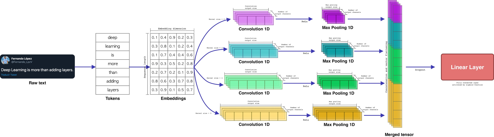
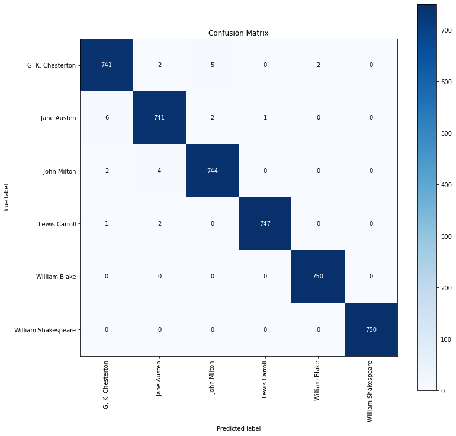

# Classification
## Authorship
&nbsp;&nbsp; The art and science of discriminating between writing styles of authors by identifying the characteristics of the persona of the authors and examining articles authored by them is called Authorship Analysis.<br/>
Here we are doing the authorship by examining the articles written by that author. <br/>

## Data Preperation
&nbsp;&nbsp; I chose 6 books at randomm from 'gutenberg' in **nltk** library. It contains 18 books of twelve authors.Then I created a dataframe of two columns as training dataset. The dataframe includes 18000 rows of 400 characters, 3000 rows for each author. Each row contains 400 characters. The starting character will be selected at random and the 399 subsequent characters will be added.

## Data Cleaning
&nbsp;&nbsp;I defined some function to clean the text before applying it to the model. This part could be one of the most time-cosuming and challenging job in data processing. Fortunately working with Latin scripts is not as hard as scrips like Persian. In our case because the texts are stories and poems, I decided touse the following functions for data cleansing. <br/>
&nbsp;&nbsp;*clean_text(x)* function removes any character which is NOT a number or an alphabet. The regular expression *[^a-zA-z'\s]* does this job. When the first character in the set notation is a caret(^), it inverts the logic. This pattern matches a single character that is anything *other than* an uppercase or lowercase letter ,"'" or white space. I kept this character "'" because we use it when we write in short forms like "aren't". I am going to replace the short form with the extended form and I need this character for that purpose. I also replaced the single characters with a white space because in our case those characters do not convey any information and will not help to the model training. <br/>

The function *replace_contractions(text)*, replaces contractions for example, "aren't" with "are not". To do this, we need a dictionary which its keys would be the contraction forms and the values are the extended form of that contraction. Then we compile a regular expression (RE) using the dictionary keys. we separate each key with "or" (i.e with this character "|") in the compiled RE. We do this by *_get_contractions(contraction_dict)*.
Data cleaning usually involve many other activities but in our case these two cleaning functions are enough.

## Feature Engineering
&nbsp;&nbsp;We can not train a model we raw text; we need to transfer it to numbers. To do this I used pre-trained "GloVe100".<br/>
First, we tokenize our text. Keras provides the Tokenizer class for preparing text documents for deep learning. The Tokenizer must be constructed and then fit on either raw text documents or integer encoded text documents.
Once fit, the Tokenizer provides 4 attributes that you can use to query what has been learned about your documents:

- **word_counts**: A dictionary of words and their counts.
- **word_docs**: A dictionary of words and how many documents each appeared in.
- **word_index**: A dictionary of words and their uniquely assigned integers.
- **document_count**:An integer count of the total number of documents that were used to fit the Tokenizer. <br/>

We just needed all unique words in our train dataset and we could do it in another wey instead of tokenizing , but using keras' tokenizer is the easiest way. We use the indexes of **word_index** dictionary  which are the requied words, to create our final embedding matrix. <br/>

### How to use GloVe (Global Vector)
&nbsp;&nbsp;In GloVe100, each word has been represented by a vector of 100 dimensions. There are other version of GloVe. The [glove.6B.100d.txt](https://nlp.stanford.edu/projects/glove/) (download glove.6B.zip), contains 400,000 vectorized words. Each word separated from its assocated vector with a space. It has already been trained which means if two words have similar semantics, their associated vectors will have similar numbers. It is also possible to train it ourselves based on our courpos. In this case we just rely on local statistics (local context information of words) but GloVe leverages both global and local statistics of a corpus. <br/>

The function **load_glove(word_index)** takes our train dataset unique words, finds that words in the *glove.6B.100d.txt* which is already converted to a dictunary (embeddings_index). The keys in this dictionary are words and the values are arrays of 100 numbers. This function return a matrix of numbers with 21481 x 100 dimensions.  (21481 is the number of unique words in our courpos and may change if you run the code.). we use this matrix to train our models. <br/>

# Text Classification with Deep Neural Network Models
&nbsp;&nbsp; I will compare two famous deep learning models namely, LSTM and CNN, in the text classification job.
## Text classification with CNN in Pytorch

&nbsp;&nbsp; As we know, CNNs are originally invented for computer vision.  With the same idea as in computer vision, CNN model is used as an feature extractor that encodes semantic features of sentences before these features are fed to a classifier.One of the earliest applications of CNN in Natural Language Processing was introduced in the paper [Convolutional Neural Networks for Sentence Classification (Kim, 2014)](https://arxiv.org/abs/1408.5882). I have already explained about CNN [here](https://github.com/HosseinDvz/Python/tree/main/Deep-Learning/CNN). For image classification, each kernel extracts a feature like a color or a line in a picture but in the context of text classification, kernels extract semantics from the text. See the following picture from https://towardsdatascience.com/:

<p align="center"><br/>
  
 First, each input sentence go through the already provided embedding matrix and converted into numbers. i.e The relevant vectore for each word in the sentence will be found and extracted from the embedding matrix and put together to privide the input matrix. In our case, each row of the matrix has 100 columns and the number of rows depend on the number of words which are 200 here. Then they will go through differen parallel (like GoogleNet) one dimensional convolutional layers with different kernel sizes. For this job, we do not need to stack convolutional layers and one layer would be enough.
  
 In our CNN, we have three different kernel size of 1,2,3. the number of each kernels is 30. These paramaters can be changed and I suggest you to change them and see the results. Here is the results after 8 epochs:<br/>
  ```
  Epoch 3/8 	 loss=22.4788 	 val_loss=15.1590  	 val_acc=0.9800  	 time=14.37s
  Epoch 8/8 	 loss=4.8529 	 val_loss=3.9497  	 val_acc=0.9940  	 time=13.79s
  ```
  and here is the confusion matrix:<br/>
  <p align="center"><br/>
    
 
 &nbsp;&nbsp; As we see, CNN achieved pretty good results in our text classification task.<br/>
  In clustering segment, when I try to analyse the input, we will see why model can not achieve %100 accuracy.
 
 ## Long-Short Term Memory (LSTM)
 
  
 
  
 
  
  
 


