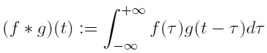
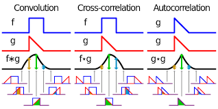
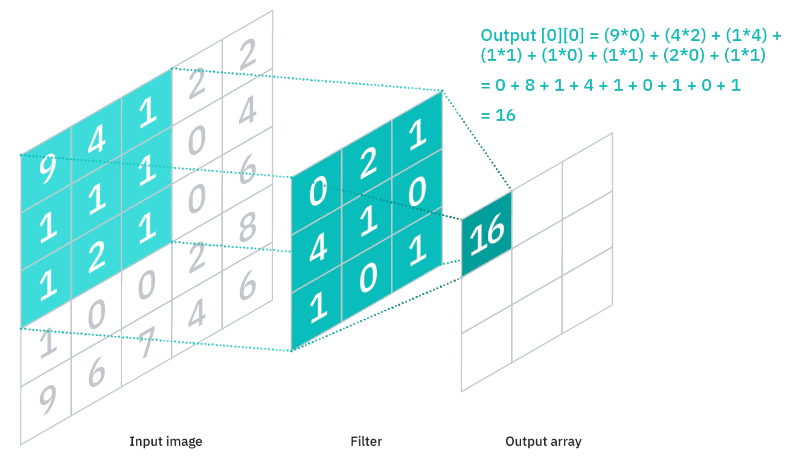
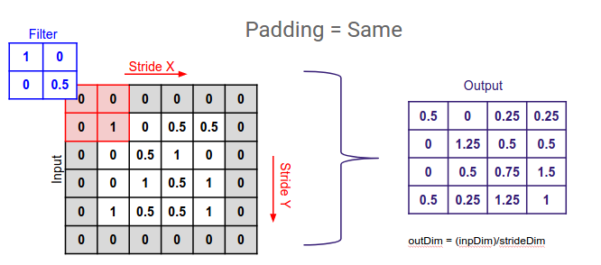
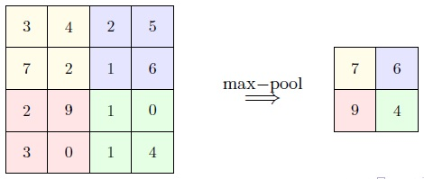
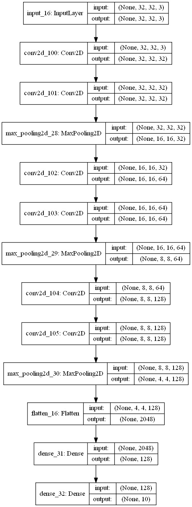
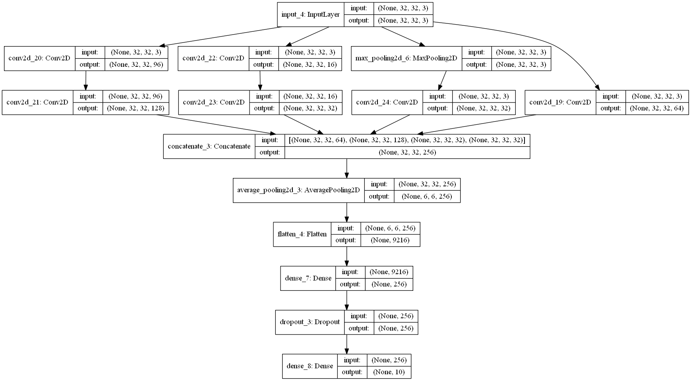

# Convolutional Neural Networks
 ## Convolution Definition:
 &nbsp;&nbsp;In mathematics (in particular, functional analysis), convolution is a mathematical operation on two functions (f and g) that produces a third function (f*g) that expresses how the shape of one is modified by the other. The term convolution refers to both the result function and to the process of computing it.<br/>
 
 <p align="center"><br/>

Convolution is commutative.<br/> 
  &nbsp;&nbsp; I became familiar with convolution in Signal Processing. To completely understand what is convolution and how to calculate it watch this [video](https://www.youtube.com/watch?v=LIs0h34iFN8&list=PLJ-OcUCIty7evBmHvYRv66RcuziszpSFB&index=11). <br/>
In the context of Deep Learning, when we talk about the *Convolution* of f and g, we actually talk about the **correlation** of f and g which is sliding one signal (f) through the other one(g) without flipping it but in Convolotion we flip one signal over the y-axis. Correlation is a measurement of the similarity between two signals/sequences. Convolution is the measurement of the effect of one signal on the other signal. Correlation is NOT commutative. The following image from Wikipedia shows the difference.
 <p align="center"><br/>
 
 ## Main Idea behind the CNNs
 &nbsp;&nbsp; The idea is similar to filtering the signals; for example, when we pass a signal through a lowpass system(filter), it rejects the high frequencies and keeps low frequencies in the signal. <br/>
   In the context of CNN, the function f would be our input, the function g will be our filter. We are going to have a couple of filters (Kernel). Each kernel extracts a feature in the picture. For example, one kernel may find horizontal lines and one kernel the vertical lines or a specific color. Those features will be combined and passed to an MLP for classification. Actually, what CNNs do in recognizing a picture is very similar to what we do; first, we identify the important parts of the picture and then decide what it is. <br/>
   
   
 &nbsp;&nbsp;There are two benefits to filtering the image before passing it to an MLP. Firstly, CNNs do not ignore the vicinity of two pixels.  In a normal network, we would have connected every pixel in the input image to a neuron in the next layer. In doing so, we would not have taken advantage of the fact that pixels in an image are close together for a reason and have special meaning. The following image shows how the input convolves. Secondly, we just send the important parts of our picture to MLP for classification, not the whole picture. For example, our pictures may have a white background, we do not send a lot of useless "255" to our network which won't contribute to classification. (zero is taken to be black, and 255 is taken to be white) <br/>
 <p align="center"><br/>
  The numbers in the filters are what the network updates and learns during the learning process along with the weights of MLP after flattening. We do not assign any filter for any feature, the CNN does this for us. It starts with random numbers for each filter. The number of channels in the output layer is equal to the number of filters and dimensions of the output array (each feature map) depends on input dimensions, filter size, and how filters stride over the input; in the above example if stride = 2 then the output will be a 2x2 array. 
  
Sometimes, we want the output of a convolution layer i.e, our feature map, has the same size as input. In this case, we use **same padding**. As you see in the following picture we add zeros to input: <br/>
<p align="center"><br/>
 
 
 &nbsp;&nbsp;The original input before padding and output has the same 4x4 dimensions. By padding every pixel will equally contribute to feature map (without padding, the border numbers contribute less than the numbers in the midddle of input) .<br/>
<br/>

 
 **Pooling** refers to reducing a feature representation by (usually nonlinear) down sampling. The most commonly used pooling is max pooling, although there
isn’t any theoretical characterization of its behaviour. Average pooling is another pooling method.
On a 2D feature map, pooling is usually done over a p x p window and with stride p. That is, a window of size p x p hops on the feature map with step size p, and the maximum element in each window is extracted to form a reduced feature map. As we go deeper to the network, the number of filters increases but the width and height of the feature maps decrese.
   <p align="center"><br/>
 
 The following picture shows the full architecture of a CNN. A picture of 28x28x1 convolved to n1 (number of filters(kernel)) feature maps of size 24 x 24 (width of image - (width of kernel - 1) : 28 - (5 - 1) = 24). This formula works when stride = 1. 
  
 <p align="center"><br/>  
  
  
    
# CNN in Python
&nbsp;&nbsp;There are many CNN-based models like LeNet-5 (1998), AlexNet (2012), VGGNet (2014), GoogleNet (2014), ResNet (2015) and DenseNet (2016). in the code I tried to implement VGGNet (2014), GoogleNet (2014) and ResNet (2015) on CIFAR10 dataset.
   ## VGGNet
&nbsp;&nbsp;The VGG convolutional neural network architecture, named for the Visual Geometry Group at Oxford. The architecture was described in the 2014 paper titled [“Very Deep Convolutional Networks for Large-Scale Image Recognition”](https://arxiv.org/abs/1409.1556). The key innovation in this architecture was the definition and repetition of what we will refer to as VGG-blocks.We can generalize the specification of a VGG-block as one or more convolutional layers with the same number of filters and a filter size of 3×3, a stride of 1×1, same padding  so the output size is the same as the input size for each filter, and the use of a rectified linear activation function. These layers are then followed by a max pooling layer with a size of 2×2 and a stride of the same dimensions.<br/>
 In the codes, we do not exactly follow the arcitecture that was described in the above article because those architectures are for large-scaled image like 224x224. Even though a large-scaled image causes the model to have many parameters and hard to train, but I think low-scaled images like CIFAR10 has its own challenge of training because some of those pictures are hard to be recognized even by human because of the quality. <br/>
  Our VGG has the following architecture:<br/>
 <p align="center"><br/> 
  
  
  Each two convolution layer plus max-pooling, produces a VGG block, so our network has three VGG blocks with one dense layer of 128 neurons.
  ```
  Epoch 10/20
45000/45000 [==============================] - 68s 2ms/step - loss: 0.4061 - accuracy: 0.8866 - val_loss: 0.7703 - val_accuracy: 0.7884
Epoch 20/20
45000/45000 [==============================] - 68s 2ms/step - loss: 0.2186 - accuracy: 0.9600 - val_loss: 1.1139 - val_accuracy: 0.7854
10000/10000 [==============================] - 7s 682us/step
model accuracy=  [1.172061269903183, 0.7728999853134155]
```
The total number of trainable parameters was 550,570 and I could get %77 accuracy on test dataset which is good.<br/>
 The above results show model starts to memorize the training dataset  after iteration 10 (overfitting - look at the gap between in-sample (%96) and out of sample acurac (%78)) which means we can stop training the model on iteration number 10 without decreasing the model accuracy. To avoid overfitting, we can do some preprocessing on the input images and instead of using constant learning rate, update the learning and make it smaler when we are close to the optimum. 
 ## GoogleNet
  While we are designing a network with convolutional layers, before the Dense layer, we need to decise about:
  - whether we want to go with a Pooling or Convolutional operation;<br/>
  - the size and number of filters to be passed through the output of the previous layer.<br/>
  what if we were able to try our different options all together in one single layer? To answer this question, Google researchers developed a new architecture of layer called Inception. The inception module was described and used in the GoogLeNet model in the 2015 paper by Christian Szegedy, et al. titled [“Going Deeper with Convolutions.”](https://www.cv-foundation.org/openaccess/content_cvpr_2015/html/Szegedy_Going_Deeper_With_2015_CVPR_paper.html). <br/>
  In each VGG block, we stack convolution layers but here, in each inception module, we use covolution layers with different kernel sizes in parallel. This is a very simple and powerful architectural unit that allows the model to learn not only parallel filters of the same size, but parallel filters of differing sizes, allowing learning at multiple scales.The convolution layers with filters of size 1x1, act as a tool for increase or decrease the number of feature maps.<br/>
 Here is the arcitecture of or GoogleNet network: <br/>
  <p align="center"><br/> 
  As you see in the above picture, we send the input to diferent convolution layers with differnt number of filters and then concatenate the output of them. The convolution layers work in parallel. In our example we have just ne inception module and I could get 70% percent accuracy on CIFAR10 dataset. Here is the results of last iteration: <br/>
 
```
   
Epoch 20/20

45000/45000 [==============================] - 206s 5ms/step - loss: 0.5045 - accuracy: 0.8198 - val_loss: 0.9683 - val_accuracy: 0.7018

10000/10000 [==============================] - 18s 2ms/step
model accuracy=  [0.9846970697402954, 0.6901000142097473]<br/>

```
  The second number in the list is portion of true predictions on test dataset. 
   
 The total number of trainable parameter was: 2,486,506

   
 
 
 
  
  
  
  
  
    
    
