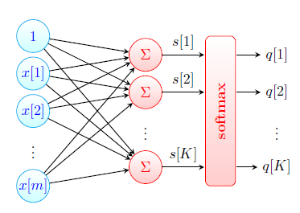
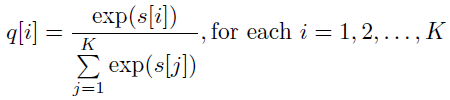
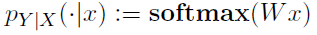
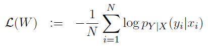
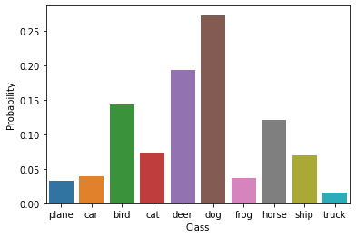

# Logistic Regression
   ## Introduction 
   
&nbsp;&nbsp; Here we have a classification problem; developing a classifier that assigns a random example X (possibly unseen) a class label
Y . In summary, in discriminative modeling,we have a data set D = {(Xi, Yi), i: 1,2,...,N} (e.g (Xi = image of a dog, Yi = dog)). we are choosing a family of hypothesis H for conditional distribution  (Modelling), then, we try to find best distribution,  , in H based on our dataset by using Maximum Likelihood Estimator or Maximum a *Posteriori* Estimator (Learning). In the case where Y = {0,1} for an unseen Xi, we declare   Y = 1 if  and Y=0 otherwise (Classification/Prediction). It is easy to show that Maximum Likelihood Estimation equals to minimizing the Cross Entropy Loss.
## Logistic Regression Model
&nbsp;&nbsp; In this model, we use logistic(Sigmoid) function as activation function. The logistic function has two main attributes:<br/>
It shrinks any value to the interval (0,1), so we can interpret the shrunken value as a probability and, It has a good derivative property.

<p align="center">

 <p align="center">
    
  <p align="center">

Now, we can define the logistic regression model: <br/>
Let    parametrized by:<br/>
 <p align="center"><br/>
     
<br/> 
    
*w* blongs to *R^m*, (m is the dimension of our data) and b is the bios. *wx + b* defines a hyperplane in *R^m*. For one side of it , *where wx + b > 0*, the assigned
label will be 1, because *Sigmoid(wx + b) > 0.5*, and for the other side will be 0.
     
We define the Cross Entropy Loss function:<br/>
 <p align="center">
     
 <br/>

We are going to find w:= argmin(L(w)),<br/>
It can be shown that the derivative of loss function is:<br/>
  <p align="center">
        
     
     
Then, we update the weights for GD and mini batch GD: 
<p align="center">

      
The Logistic Regression Model as a neural network when we are going to classify our data into two categories will be like this:
     <p align="center">
## Multinomial Logistic Regression Model 
<br/>        
&nbsp;&nbsp;In cases, we have more than two categories, For example, 10 classes, instead of Sigmoid, we use Soft-Max as activation function and our network will have 10 neurons - one neuron for each category - before the activation layer.
   <p align="center">

      
Each neuron provides a hyperplane in R^k (k is the dimension of our data). when we apply data to the network, each neuron will return a number. Those numbers will pass through the Soft-Max to normalize the output of the network to a probability distribution. 
       
The Soft-Max function, model and the loss function are as following:<br/>
    
 <p align="center">   
      

Here, q(i) is the probability of belonging to class i, and s(i) is the output of the neuron assigned to class i.
      
   <p align="center">
   <p align="center"><br/>

      
      
      
      
      
      
      

# Multinomial Logistic Regression in Python
&nbsp;&nbsp;I imported Keras library just to load MNIST dataset and *sklearn* library to implement multinomial logistic regression.
  The MNIST database (Modified National Institute of Standards and Technology database) is a large database of handwritten digits that is commonly used for training various image processing systems. The database is also widely used for training and testing in the field of machine learning (Wiki). Each picture has 28 * 28 pixels. 
   MNIST is one of the Keras datasets and we can easily load it. There are 70000 pictures of handwritten digits. Each of them is in the form of a 28 * 28 matrix (one number for each pixel range from 0 to 255. black is zero and white is 255). So the whole data set is an array of shape 70000 * 28 * 28. 

&nbsp;&nbsp;In the code, first I divide the data into two sets, 60000 for training and 10000 for testing the final model. Then we flatten the data by transforming the array of size 60000 * 28 *28 into an array of size 60000 * 784 (i.e 28 * 28 = 784) and then normalizing it by dividing each number to 255. <br/>
```
 (X_train,y_train),(X_test, y_test) = mnist.load_data()
classes = ['0', '1', '2','3', '4','5', '6', '7', '8', '9']
nclasses = len(classes)
X_train[0].shape
#normalizing and flattening the data
image_vector_size = 28*28
X_train_final = X_train.reshape(X_train.shape[0], image_vector_size)/255.0
X_test_final = X_test.reshape(X_test.shape[0], image_vector_size)/255.0
```
<br/>
      

Then, the logistic regression model will be parameterized and trained. There are different parameters associated with the model like *penalty* (for regularizing),
*multi_calss* (To tell the model we have a binary or multiclass classification), *solver* (the algorithm that trains the model like "saga"; Stochastic Average Gradient
Descent). Read the help for other parameters. There should be a harmony between the parameters of the model. For example, you can not use 'liblinear' solver for
multinomial regression. 
```
clf = LogisticRegression(penalty='none', 
                         tol=0.05, solver= 'saga',
                         multi_class='multinomial').fit(X_train_final, y_train)
```

After training our model, we have ten equations (one for each neuron) each of them has 784 weights. They will be saved in an array of shape 10*784. There is a plot in
the code that shows which weights are important (bigger) for what number. Bigger weights are in blue.
      
Then, I choose a sample to show how the model works and plot the results. finally, I compute the accuracy of the model by testing the model on test data. The accuracy
was 92.68. you may find a better combination of model parameters and achieve higher accuracy. 

  It is possible to apply the cifar10 dataset by some changes in the code. The CIFAR-10 dataset (Canadian Institute For Advanced Research) is a collection of images that are commonly used to train machine learning and computer vision algorithms. It is one of the most widely used datasets for machine learning research.[1][2] The CIFAR-10 dataset contains 60,000 32x32 color images in 10 different classes.[3] The 10 different classes represent airplanes, cars, birds, cats, deer, dogs, frogs, horses, ships, and trucks. There are 6,000 images of each class. (Wikipedia). The numeric form of each image is a 32*32*3 matrix. Assume we stack three matrix of dimension 32*32 for each image. We have three matrix because of the main three colors; Red, Green and blue. Each matrix shows, for example, the distribution of red color in each pixel of image. Therefore, we flatten the each image in a vector of size 32*32*3. that is the only part that needs to be changed in the MNIST code. <br/>
  Soft-Max Regression Model is not very powerful on classifying color images.The model accuracy would be around 42%. To see how model works,in the codes, I choose the image no 1235 from test dataset which is a dog and ask model to assign a label to it. the following plot shows how model think about that image.
      
  <p align="center"><br/>  
      
  Even though the model finally says it is the image of a dog but is assigns high probabilities to deer, bird and horse which not good. This plot will give us a sense why we got 42 percent accuracy. Convolutional Neural Network (CNN) is the best model in classifying color images and I will introduce it in another section.
      
 
