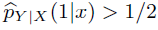

# Logistic Regression
   ## Introduction 
&nbsp;&nbsp; Here we have a classification problem; developing a classifier which assigns a random example X (possibly unseen) a class label
Y . In summary, in discriminative modeling,we have a data set D = {(Xi, Yi), i: 1,2,...,N} (e.g (Xi = image of a dog, Yi = dog)). we are choosing a family of hypothesis H for conditional distribution  (Modelling), then, we try to find best distribution,  , in H based on our dataset by using Maximum Likelihood Estimator or Maximum a *Posteriori* Estimator (Learning). In the case where Y = {0,1} for an unseen Xi, we declare Y = 1 if  and Y=0 otherwise (Classification/Prediction). It is easy to show that Maximum Likelihood Estimation equals to minimizing the Cross Entropy Loss.
## Logistic Regression Model
&nbsp;&nbsp; In this model, we use logistic(Sigmoid) function as activation function. Logistic function has two main attributes: 
It shrinks any value to the interval (0,1), so we can interpret the shrunken value as a probabilty and, It has a good derivative property.

 

    
  

Now, we can define the logistic regression model:  
Let    parametrized by: 
    

     
w belongs to R^m, (m is the dimension of our data) and b is the bios. wx + b defines a hyper plane in R^m. For one side of it , where wx + b > 0, the assigend lable will be 1, because Sigmoid(wx + b) > 0.5, and for the other side will be 0.
     
We define the Cross Entropy Loss function: 
 

     
 We are going to find w:= argmin(L(w)),br/>
     
 It can be shown that the derivative of loss function is: 
  

        
     
 Then, we update the weights for GD and mini batch GD: 
   

      
  The Logistic Regression Model as a neural network when we are going to classify our data into two categories will be like this:
     

