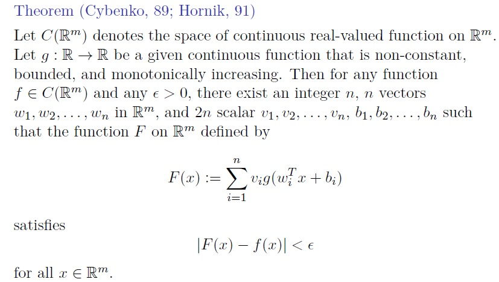
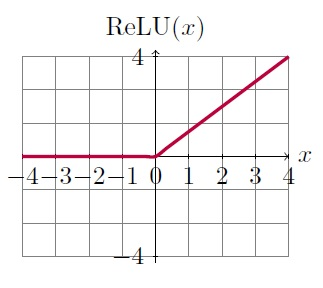
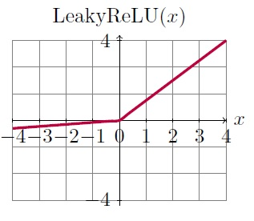

# Multilayer Perceptron
&nbsp;&nbsp; Before delveing into MLP, let go through Universl Approximation Theorem.
## Universal Approximation Theorem

<p align="center"><br/>
  
 In summary, theorem says it is possible to approximate any function with a single hidden layer perceptron if it is wide enough. 
A neural network is merely a computation graph representing the compositions of a set of functions.
  <p align="center"><br/>
    
  &nbsp;&nbsp;The above image shows a MLP with two hidden layers. the depth of the network refers to the number of hidden layers and the width, refers to the number of neurons in each hidden layer. We must design the architecture of the network, including how many layers the network should contain (depth), how these layers should be connected to each other, and how many units should be in each layer (width). A single-layer neural network can only be used to represent linearly separable functions. A Multilayer Perceptron can be used to represent convex regions. there is a theoretical finding by Lippmann in the 1987 paper ["An introduction to computing with neural nets"](https://ieeexplore.ieee.org/abstract/document/1165576) that shows that an MLP with two hidden layers is sufficient for creating classification regions of any desired shape. there is not any fixed rule for the architecture of the MLP; it depends on the nature of the problem and some people believe it is a work of art.<br/>
 The number of network parameters will be more sensitive to width of the network. For example, a MLP with six hidden neurons in one hidden layer will have more parameters than a MLP with six neurons in two hidden layers. In the code, we explore how changing the width and depth of the network will affect the results.<br/>
    
&nbsp;&nbsp;The Activation Function is another important factor which computes the hidden layers values. We explored one of them, the Logistic Function and its charactristics in [Logistic Regression](https://github.com/HosseinDvz/Python/tree/main/Deep-Learning/Logistic%20%26%20Softmax%20Regression). Another important activation function is Rectified Linear Unit activation function (ReLU): **g(z) = max{0,z}**.
<p align="center"><br/>
  
  &nbsp;&nbsp;This activation function is the default activation function recommended for use with most feedforward neural networks. Applying this function to the output of a linear transformation yields a nonlinear transformation. However, the function remains very close to linear, in the sense that is a piecewise linear function with two linear pieces. Because rectified linear units are nearly linear, they preserve many of the properties that make linear models easy to optimize with gradientbased methods. They also preserve many of the properties that make linear models generalize well.(Deep Learning, Goodfellow). <br/>
  
 g(z) = max{0,z} + a * min{0,z} is the generalization of ReLU and depend on the values of a, we have different functions:
  - Leaky ReLU (another commonly used activation function) :very small a
 <p align="center"><br/>
   
   
 - Absolute value function : a = -1 <br/>
   
 - Prametric ReLU (PReLU) : learnable a <br/>
## Implementing MLP in Python
   &nbsp;&nbsp;I used *keras* library to implement MLP and MNIST dataset. To see how architecture of our network affects the result, I designed three experiments. In the first experiment, the number of layers (depth) of the network will change and width of the network remains constant. In the second experiment, the number of neurons in a MLP with one hidden layer will change and in the third exeriment, both width and depth of the network are changing. I used ReLU for hidden layer activation function (you can also get similar results with sigmoid), Stochastic Gradient Descent as optimization algorithm. The loss function is CrosEntropy loss which was explained in [Logistic Regression](https://github.com/HosseinDvz/Python/tree/main/Deep-Learning/Logistic%20%26%20Softmax%20Regression). <br/>
  
 The following functionin in the code, defines the architecture of our network:
```

   def create_dense(layer_sizes):
    model = Sequential()
    model.add(Flatten())
    model.add(Dense(units=layer_sizes[0], activation='relu', input_shape=(image_size,)))

    for s in layer_sizes[1:]:
        model.add(Dense(units = s, activation = 'relu'))

    model.add(Dense(units=num_classes, activation='softmax'))
    return model
  ```

  &nbsp;&nbsp; The *layer_sizes* will be created in *experiment* functions which are lists of integers. Each digit in the lists shows the number of neurons. The *Sequetntial()* is the model for linear stack of layers and usually used to design MLPs in Python. *Flatten()* will flatten the input. Each image in MNIST dataset is a 28x28 matrix. after flattening, it becomes a 1x784 matrix. Then we add hidden layers to our MLP by *model.add(Dense)*. We need to define the inut shape just for the first hidden layer. *units* represent the output shape of that layer (i.e the number of neurons on that layer). After hidden layers, we need to add the output layer. the number of neurons in output layers are always equal to the number of classes and the activation function for this layer is Soft-Max to normalize the output of the network to a probability distribution. <br/>
   
  ## Analysing the experiments
&nbsp;&nbsp;In the experiment_1 I try to show the effect of depth of the network on the results. I start with a MLP with one hidden layer and 256 neurons. The results shows 89 percent accuracy on the test dataset. Then, another hidden layer with 256 neurons will be added to the model and accuracy will dramatically decrease to around 10 percent. It does not mean increasing the depth always produces the bad results but in our case, it was not a good idea to increase the depth. 
 In experiment_2, the width of the network will change. By increasing the width of network, the accuracy of the model increases. 
In the experiment_3, the width and depth increases and the result will be printed. <br/>
 
  &nbsp;&nbsp;In each experiment, the model summary shows the number of layers, neurons per layers and the total number of trainable parameters. <br/>
   Another important hyper paramater that we do not see here but it exists, is the initial weights of our network. You can read about the different weight initializers [here](https://keras.io/api/layers/initializers/). Each layer has its own weight initializer but for most of the layers, such as Dense, convolution and RNN layers, the default kernel initializer is *glorot_uniform*. You can read about it the above link. To see the effect of weight initializer, you can manually define the initializer and run the experiments to see the results. <br/>
 
   
  
   
   
   
