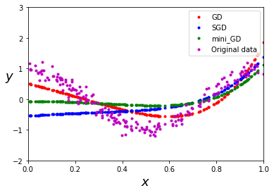

# Regression
 
   In this project we are going to explore the fitting and generalization of regression models via simulation without using Python libraries. Here, we can see how changing the parameters of our regression model (namely, degree of the polynomial), the number of data points, the quality of data (by adding noise) or adding a regularizer can affect the results.<br/>
 
   Suppose that X and Y are both real-valued random variables, where X takes value in (0, 1) and Y depends on X according to: <br/>                                          <p align="center">**Y = cos(2*pi*X) + Z**<br/>
  
 where Z is a zero-mean Gaussian random variable with variance *sigma^2*, and independent of X. But we assume
that we do not know this dependency of Y on X and that you only observe a sample of N (X, Y ) pairs.
Based on the observed sample, we will learn a polynomial regression model and examine the fitting and
generalization capability of our model in relation to the model complexity, sample size other factors.<br/>
  
 ## Manual Implementation of Gradient Descent (GD)
  
  Gradient Descent is probably the most famous optimization algorithm and the backbone of many other optimization algorithms. Here, I manually implemented this algorithm.
To understand how Gradient Descent works, go this link (min 53).<br/> (https://www.youtube.com/watch?v=qSTHZvN8hzs). <br/>
  
The main problem in implementing the GD is taking the derivative of the loss function. The loss function here is the Mean Square Error (MSE). I have used a very simple and creative idea to take the derivative. Manual implementation of GD for Neural Networks with multiple layers would be more complicated. 
The function we are going to fit our data is a polynomial with degree d :<br/>
  
                                          <p align="center">**Y=a0 + a1X + a2X^2 + ...+ adX^d** <br/>
                                         
(i.e The above equation is not MSE formula, It is part of MSE and the part we need to take its derivative).<br/>
                                           We are going to find (a0,a1,...,ad) so we need to take the derivative with respect to (a0,a1,...,ad)  which all of them are degree 1. therefore, their derivative would be their coefficients X,X^2, ..., X^d. It was possible to use Pytorch for this purpose but I tried to make the code as simple as possible and using simple solutions. The following fuction does this job in the code and provide the deraivative matrix: <br/>

                                         
                                         
```
def grad_matrix(x,d):
    
     if d==0:
         return np.ones((len(x),1))
     elif d==1:
         return np.c_[np.ones((len(x),1)),x]
     
     X_grad = x    
     for i in range(2,d):
        x_add=[]
        x_add = x**i
        X_grad = np.concatenate((X_grad,x_add), axis=1)
        
     X_grad_b = np.c_[np.ones((len(x),1)),X_grad]

```
<br/> d is the degree of the model which is one of the user's inputs and x is our data. I have implemented Gradient Descent, Stochastic Gradient Descent(SGD), and Mini Batch Gradient Descent. the "x" will be different in any of these methods. GD uses all data in each iteration, mini-batch GD uses a batch of data (the size of the batch is one of the user's inputs) and SGD uses just one data point in each iteration. So, the most accurate algorithm is GD, then mini-batch GD, and the fastest and least accurate one is SGD for the fixed number of iterations for all optimization algorithms. You will see how MSE will react to each algorithm. Choosing between optimization algorithms depends on the different factors. <br/>
                                                                     
When you run the code, It will ask you to provide inputs for different parameters. By playing around with them, you will find a clear understanding of basic concepts in Machine Learning like overfitting and regularizing. For example, to see how regularizer (the regularizer here is Weight Decay(WD)) will help to reduce in-sample (E_in in the codes) or out of sample errors, choose a high variance for noise (Z) and run an experiment without WD and an experiment with WD (obviously other parameters should be constant).<br/>
                         
```    
Here is the results for the following prameters:<br/>
                                           
Enter the number of training data point(integer): 200

Enter the variance of the noise: .15

Enter the model degree (integer): 6

Enter the number of iteration(integer): 200

Enter the learning rate: .4

Enter the batch size for mini-batch GD(integer): 40

do you want to apply weight decay?(y/n) n


Gradient descent coeffients:  [[ 0.51174238 -1.91338345 -1.08639981  0.76928197  0.40052162  3.1839693 ]]
MSE for grdient descent:  2942.232463702175


Stochastic Gradient descent coeffients:  [[-0.54615669  0.52496001 -0.5362781   0.26935793 -0.50726072  2.18582534]]
MSE for Stochastic Gradient descent:  9478.507569285512


Mini batch Gradient Descent coeffients:  [[-0.06611876 -0.00718865 -0.79601411  0.20558643 -0.47178651  2.26552147]]
MSE for Mini batch Gradient Descent:  6625.502686156475


E_out for Gradient Descent(GD) for 1000 test data: 78617.751 
E_out for Stochastic GD for 1000 test data: 242336.480
E_out for mini GD for 1000 test data: 171081.840
```
                                           
 
                                           
                                        
  
 At the end, the program will ask you about running an experiment or not. There is a function in the codes that does the following: <br/>
It takes as input the size N of training dataset, the degree d of the
model polynomial and noise variance sigma^2, and does the following. For the given values of N,d and sigma^2, it
loops over M trials (M is 50 in the codes), where each trial is defined
as generating a training dataset of size N and noise variance sigma^2 (by calling getData) and then fitting the
data to a polynomial of degree d (by calling fitData). The computed E_in and E_out are respectively averaged
over the M trials, which are denoted by Ein_avg and Eout_avg. The obtained M polynomials over the M trials are
also averaged. The function then generates another large dataset with noise variance sigma^2 and computes the
average MSE for the dataset fitted to the average polynomial. This MSE will be denoted by E_bias. The
function outputs E_in;E_out and E_bias. <br/>
The experiment will be run over all combination of N = {2,5,10,20,50,100,200}, d = {0,1,2,...,20} and sigma^2 = {0.01, 0.1,1}. There is a function ,combination(), that stores all the combinations in a list. <br/>.
                                           Finally, I provide some plots that summarize the results of the experiments and provide some insights.
 
 
